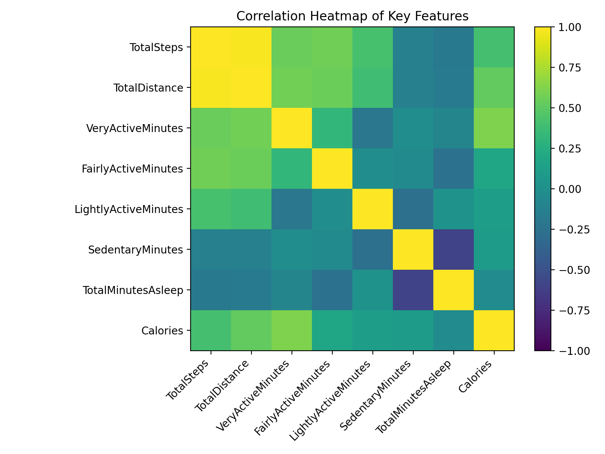
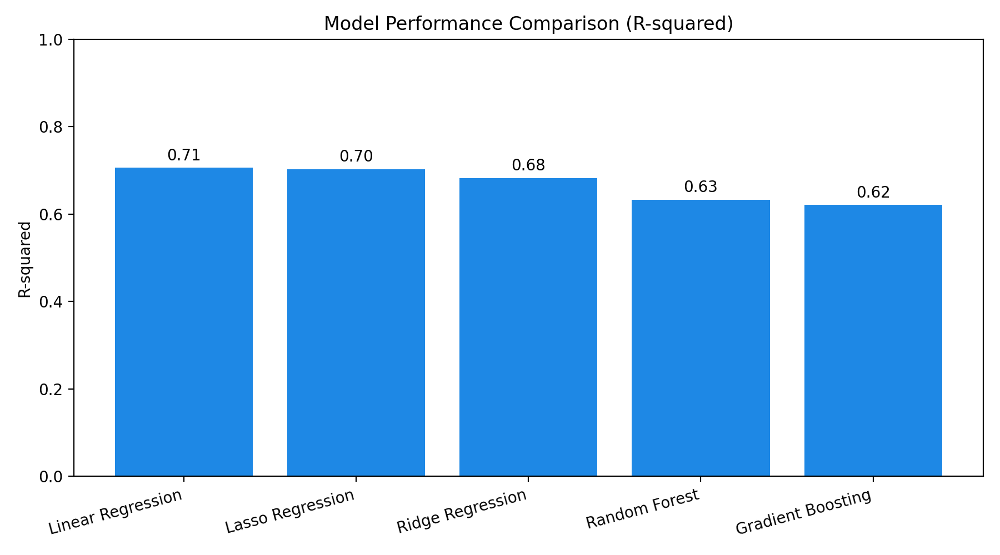

# FitTrack — Data Analysis & AI Dashboard

A modern Streamlit app that turns raw fitness and sleep summaries into insights you can act on. Explore your daily activity, run what‑if scenarios, and download personalized reports.

Live app: https://fittrack-data-analysis-m4tskwxkda2u6ne5lxtdxq.streamlit.app/

---

## Highlights

- Interactive Overview with KPIs and rich Plotly visualizations
- What‑if Analysis: tune daily metrics and see instant calorie‑burn predictions
- Model‑driven insights + sensitivity analysis (which features move the needle)
- One‑click report download (Markdown and PDF)
- Reproducible notebook for EDA, modeling, and artifact export

---

## Data Sources

- Activity: `data/dailyActivity_merged.csv`
- Sleep: `data/sleepDay_merged.csv`
- Cleaned dataset generated to `data/cleaned_fitness_data.csv`

The app uses the cleaned merge of daily activity and sleep summaries. Dates are normalized, unused columns removed, and duplicates dropped.

---

## Visual Explorations

- Correlation heatmap of key drivers vs. calories

  

- Steps vs. Calories and Sleep vs. Activity (rendered live in the app with trendlines)

---

## Modeling

- Target: `Calories`
- Features: `TotalSteps`, `TotalDistance`, `VeryActiveMinutes`, `FairlyActiveMinutes`, `LightlyActiveMinutes`, `SedentaryMinutes`, `TotalMinutesAsleep`
- Train/test split: 80/20
- Scaling: `StandardScaler`

### Models Trained

- Linear Regression
- Ridge Regression
- Lasso Regression
- Random Forest Regressor (random_state=42)
- Gradient Boosting Regressor (random_state=42)

### Model Selection & Why

We compare models by R‑squared on the hold‑out test set and select the top performer. In this dataset, Linear Regression ranked highest and was chosen as the production model for its:

- Strong R‑squared on test data
- Interpretability (clear, linear relationship to features)
- Stability on a modest dataset size

The chosen artifacts (loaded by the app):

- `best_model.pkl` (Linear Regression)
- `scaler.pkl` (StandardScaler)

### Model Comparison (R‑squared)

This chart reflects an apples‑to‑apples evaluation on the same train/test split and feature scaling pipeline used by the app.



---

## App Walkthrough

- Overview: KPIs for days, users, average steps/calories, plus a correlation heatmap.
- What‑if Analysis: adjust steps, distance, activity minutes, and sleep to see real‑time predicted calories, feature sensitivity, and friendly guidance.
- Report: a narrative summary of your scenario with top drivers and recommendations. Download as `.md` or `.pdf` (charts embedded when static export is available).
- Exploration: broader plots (Steps vs. Calories, Sleep vs. Activity) to see where your day sits in the data.

---

## Run Locally

```bash
# 1) Install requirements
pip install -r requirements.txt

# 2) (Optional) Reproduce artifacts from the notebook
#    This creates data/cleaned_fitness_data.csv, best_model.pkl, scaler.pkl
#    Open and run notebooks/Data_Analysis_and_Model_Training.ipynb

# 3) Launch the app
streamlit run app.py
```

If you plan to export PDF reports with charts, ensure static image export is available in your environment. We use `kaleido` for Plotly static images and `fpdf2` for PDF composition:

```bash
pip install fpdf2 kaleido
```

---

## Repository Structure

- `app.py` — Streamlit UI and inference logic (what‑if analysis, insights, reports)
- `scripts/visualization.py` — Plotly figures used across the app
- `notebooks/Data_Analysis_and_Model_Training.ipynb` — EDA, feature prep, model training, comparison, and artifact export
- `data/` — raw inputs plus `cleaned_fitness_data.csv`
- `best_model.pkl`, `scaler.pkl` — saved model/scaler loaded by the app
- `docs/` — images for this README (model comparison, correlation heatmap)

---

## Notes on Reproducibility

- The notebook trains and evaluates models, then saves the winning model and scaler at the project root for the app to load.
- The README figures in `docs/` were generated from the cleaned dataset to mirror the training setup.

Happy exploring — and enjoy turning your daily movement and sleep into actionable insight!
